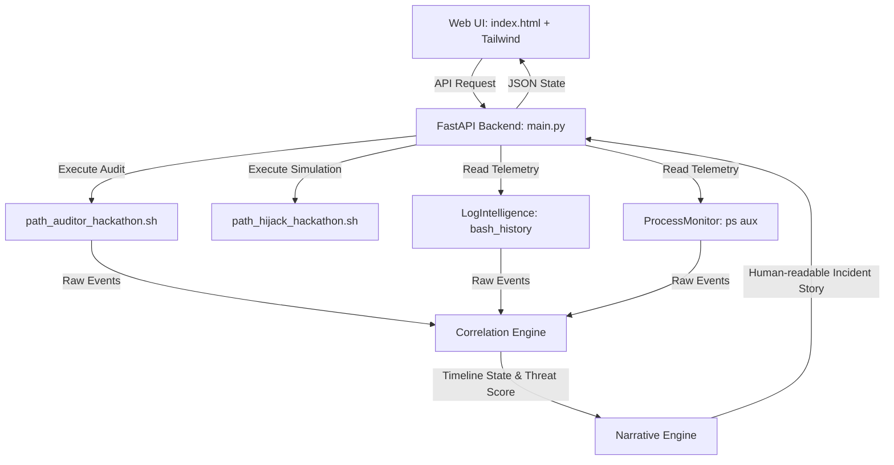

# GHOSTPATH: Command Search-Order Hijacking Auditor & Threat Simulation Platform

GhostPath is a DevOps environment integrity auditor, attack simulator, and threat correlation engine designed to detect, simulate, and remediate command search-order hijacking vulnerabilities in the local environment `PATH`. 

It features an interactive dashboard providing real-time telemetry fusion, an AI-powered incident narrative generator, and multi-stage exploit orchestration.

---

## 🌟 Key Features

### 1. PATH Precedence Auditing
* **Empty PATH Resolution:** Detects empty PATH segments (`""` or trailing colons) which default search behaviors resolve to the current working directory (`.`).
* **Relative Directory Detection:** Identifies relative paths (specifically `.`) listed before trusted system binaries, which allow local script execution overrides.
* **World-Writable Auditing:** Flags directories in the `PATH` that are writable by low-privilege users or guest accounts, preventing binary planting.
* **Hygiene and Latency Auditing:** Highlights duplicate entries and missing directories to maintain path cleanliness.

### 2. Telemetry Fusion & Correlation Engine
* **Log Intelligence:** Monitors shell command history (`~/.bash_history`) for suspicious indicators like inline path mutations (`export PATH=.:`) and permissions tampering (`chmod +x`).
* **Process Parsing:** Continuously scans running processes (via `ps aux`) for indicators of active hijack, such as network utility executions (`nc`, `netcat`) or standard interpreters running from localized or relative directories (`./python3`).
* **MITRE ATT&CK Mapping:** Translates detected indicators and vulnerabilities to real-world techniques:
  * **T1574.007:** Hijack Execution Flow: PATH Environment Variable
  * **T1059:** Command and Scripting Interpreter
  * **T1059.004:** Unix Shell command/scripting abuse
  * **T1547:** Boot or Logon Autostart Execution (unsafe persistence in shell profiles)
* **Risk Score Matrix:** Computes a composite risk score (0-10) and compromise likelihood level (`LOW`, `MEDIUM`, `HIGH`, `CRITICAL`).

### 3. Automated & Permanent Remediation Advisor
* **Phase 1: One-Click Sandbox Isolation:** Instantly sanitizes the active session's runtime `PATH`, stripping relative/empty nodes, and writes the secure state to `/tmp/ghostpath_env.txt`.
* **Phase 2: Permanent Persistence Patching:** Scans static shell profiles (`~/.bashrc`, `~/.zshrc`, `~/.profile`, `~/.bash_profile`) for unsafe definitions, recommends clean replacement lines, and auto-generates copy-paste-ready `sed` patch commands.

### 4. Interactive Exploit Replay & Terminal Console
* **Simulation Workspace:** Simulates a path hijack attack by creating a mock script named `python3` in the relative directory and running it to intercept execution.
* **Exploit Replay Console:** Displays the multi-stage lifecycle of an attack: Reconnaissance ➔ Binary Planting ➔ Victim Execution ➔ Threat Correlation ➔ Environment Remediation.

---

## 🏗️ Project Architecture



---

## 🪟 Windows Compatibility: Can it run on Windows?

GhostPath **cannot run natively** on Windows Command Prompt (`cmd.exe`) or Windows PowerShell out-of-the-box. 

### Why Native Windows is Not Supported:
1. **POSIX Scripts:** The core auditing (`path_auditor_hackathon.sh`) and hijacking scripts are written in Linux Bash.
2. **Linux Shell Commands:** The code makes direct calls to native Linux binaries (`ps aux`, `stat`, `realpath`, `which`, `chmod`, `sed`) to verify environment status and apply patches.
3. **Configuration Formats:** The backend looks for Unix-specific shell configurations (`~/.bashrc`, `~/.profile`) and expects the POSIX path separator (`:`) instead of the Windows path separator (`;`).

### How to Run it on Windows:
You can run GhostPath on Windows using **WSL (Windows Subsystem for Linux)**:
1. Install WSL (e.g., Ubuntu) on your Windows machine:
   ```cmd
   wsl --install
   ```
2. Open your WSL terminal and clone the repository.
3. Ensure Python 3 and FastAPI dependencies are installed in WSL.
4. Run the startup script inside WSL. The web server will bind to `localhost` and can be accessed seamlessly from your Windows browser.

---

## 🚀 Getting Started

### Prerequisites (Linux or WSL)
* Python 3.9+
* Bash shell

### Installation
1. Install backend requirements:
   ```bash
   pip install -r requirements.txt
   ```

2. Start the FastAPI server:
   ```bash
   uvicorn backend.main:app --host 127.0.0.1 --port 8000 --reload
   ```

3. Open your web browser and navigate to:
   ```
   http://127.0.0.1:8000
   ```
